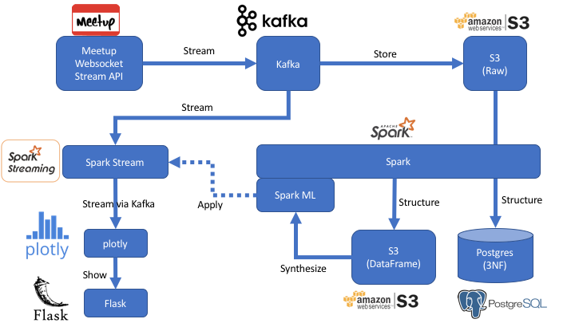
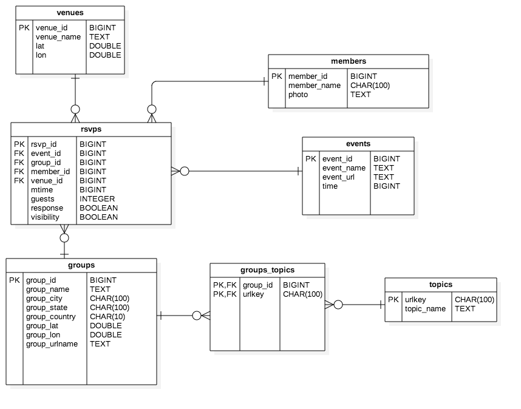

# meetup-rsvps

Study meetup RSVP stream data

## Data Source

Meetup RSVP stream API:

`http://stream.meetup.com/2/rsvps`  
`http://stream.meetup.com/2/photos`  
`http://stream.meetup.com/2/event_comments`  

[DocRef](https://secure.meetup.com/meetup_api/docs/stream/2/rsvps/#websockets)

## System Architecture Overview



### Stream
* __Kafka Websocket Producer__: recieve from Meetup Websocket Stream API, pipe to Kafka
* __Kafka Instance__: running in EC2
* __Kafka Spark Consumer__: receive from Kafka, pipe to Spark Stream for real-time analysis, then pipe dashboard data to Flask/Plotly

### Store
* __Kafka S3 Consumer__: receive from Kafka, store raw data in S3 for batch analysis

### Structure
* __Spark__: perform ETL to persist to PostgreSQL and DataFrame paquet in S3 >>> 3NF
* __PostgreSQL__: RDBMS version of structured ETL data
* __S3__: parquet-ed Spark DataFrame version of structured ETL data

### Synthesize
* __Spark ML__: 
	* load DataFrame from S3
	* perform Machine Learning tasks
	* persist model in S3 (to be loaded in Spark Stream)

### Show
* __Flask__: python web server to serve dynamic page
* __Plotly__: real-time charts to show metrics and predictions

## Compliance to BigData Properties

### Robustness and fault tolerance
* Kafka: current setup is single instance, SPoF. Future >> Scale Out
* Spark: current setup is using EMR cluster, already fault tolerant; RDD + DAG delivers resilient abstraction
* PostgreSQL: current setup is single instance. However, same info is kept in S3 DF Parquet. Future >> Scale Out
* S3: rely on Amazon to make it fault tolerant (hopefully...)
* Flask: current setup is single Flask instance, SPoF. Future >> use NginX/Apache http server + scale out

### Low latency reads and updates
* Spark RDD is imutable, delivers "read only" and "write only" aspect
* Spark Stream works on "mini batches" delivers low latency (relatively)

### Scalability
* Kafka: future scale out
* Spark: already scalable
* PostgreSQL: future scale out
* S3: already scalable
* Flask: future scale out

### Generalization
* The architecutre can be generalized to text processing
* For image/video streaming, need to benchmark performance, though should be fine

### Extensibility
* Kafka producer/consumer paradigm is flexible to handle non-frequent changes (e.g. change both side)
* PostgreSQL: RDBMS not the best to handle dynamic schema. Future: shift to Mongo
* Future to adopt Avro for true dynamic typing

### Ad hoc queries
* Offline batch aspect supported by issuing query to RDBMS, or Spark SQL
* Real-time aspect not supported as for now. Future: implement lambda architecture to support ad-hoc queries in real-time approximate sense

### Minimal maintenance
* Use Vagrant and start-up script for easy maintenance
* Use EC2 features (e.g. snapshot, monitor)

### Debuggability
* EC2 trace logs, it's there, not obvious though...

## Detail Description

### Stream

#### Websocket Poller Sample Code

```python
#!/usr/bin/env python3
import websocket
import _thread
import time

def on_message(ws, message):
    print (message)

def on_error(ws, error):
    print (error)

def on_close(ws):
    print ("### closed ###")

def on_open(ws):
    def run(*args):
        while True:
            time.sleep(1)
            # ws.send("Hello %d" % i)
        ws.close()
        print ("thread terminating...")
    _thread.start_new_thread(run, ())


if __name__ == "__main__":
    websocket.enableTrace(True)
    ws = websocket.WebSocketApp("ws://stream.meetup.com/2/rsvps",
                                on_message = on_message,
                                on_error = on_error,
                                on_close = on_close)
    ws.on_open = on_open

    ws.run_forever()
```

### Structure
Both Parquet-ed S3 DataFrame and RDBMS PostgreSQL persisted data shall conform with 3rd Normal Form (3NF).

The ER diagram as below.




### Synthesize

* General metrics:
	* E.g. Count RSVP per region
* Derived metrics:
	* E.g. Study what category of meetup is popular
* Predicted metrics:
	* E.g. Predict RSVP Yes/No based on other attributes

### Show
* Flask to render dynamic page
* Plotly to show real-time charts

## Stories
### Use Case Scenarios TBA
...

## Future
### Architecture
* Build full-fledged Lambda architecture to "merge" the real-time and batch query result, show in Web HMI

### Stream
* Distributed Kafka setup

### Structure
* Scale Out RDBMS setup (low priority)
* Shift to Mongo to support flexible/free schema

### Synthesize
* More machine learning tasks

### Show
* Query Interface
* Scale out Flask to NginX/Apache http server cluster + load balancer