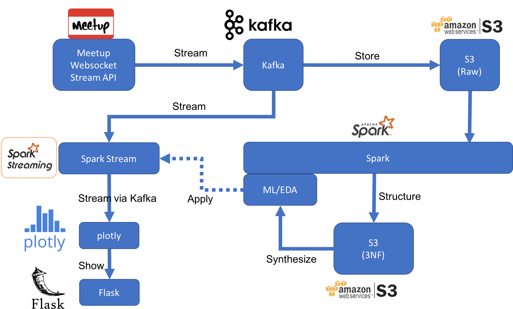
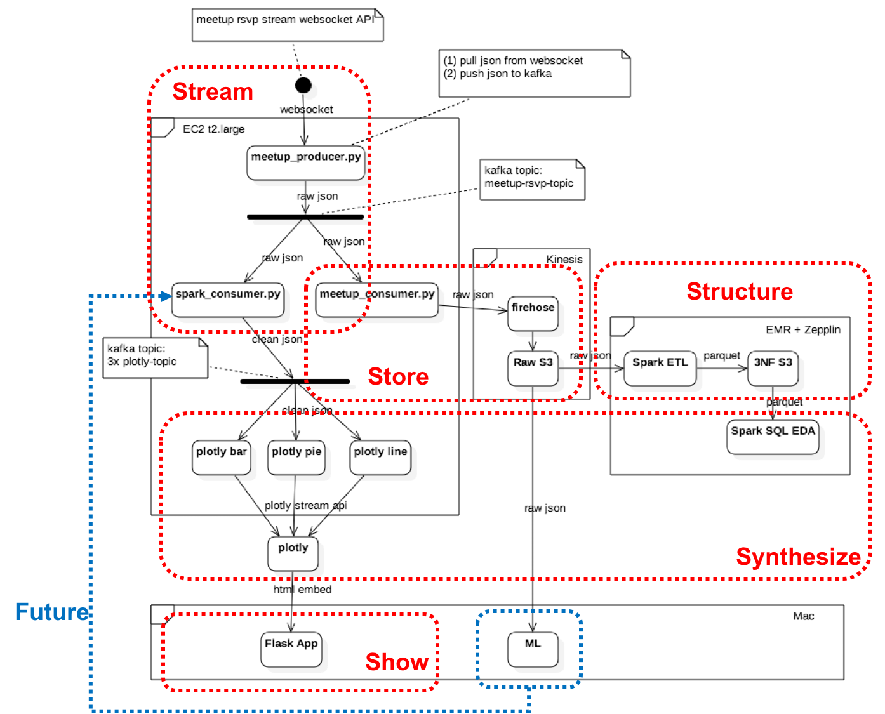
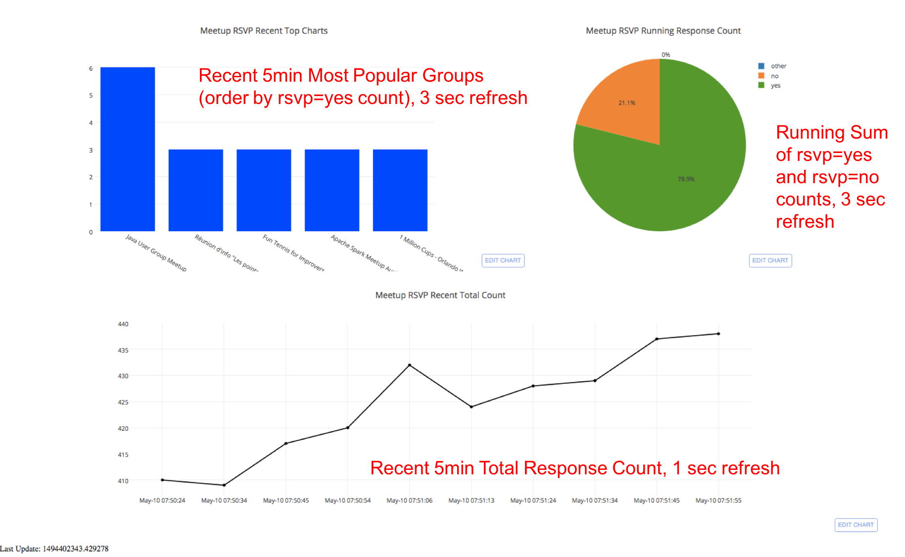

# meetup-rsvps

Study meetup RSVP stream data

## Data Source

Meetup RSVP stream API:

`http://stream.meetup.com/2/rsvps`  

[DocRef](https://secure.meetup.com/meetup_api/docs/stream/2/rsvps/#websockets)

## System Architecture Overview

### Logical View

The inidial idea of the target architecture looks like below.

### Physical View

The exact implementation is shown as below.

### Stream
* __Kafka Websocket Producer__: recieve from Meetup Websocket Stream API, pipe to 1st Kafka topic
* __Kafka Instance__: running in EC2
* __Kafka Spark Streaming Consumer__: receive from Kafka, pipe to Spark Stream for real-time analysis, then forward transformed data to 2nd kafka topic

### Store
* __Kafka Firehose Consumer__: receive from 1st Kafka topic, forward raw data to Kinesis Firehose
* __Raw S3__: receive from Firhose, store raw data in S3 bucket for batch analysis at later stage

### Structure
* __Spark ETL__: read raw data from S3, perform ETL to transform raw data into structured data, persisted as Spark DataFrame paquet in separate S3 location
* __3NF S3__: parquet-ed Spark DataFrame version of structured ETL data. The ETL transofrmed data shall conform to 3rd Normal Form.

### Synthesize
* __Spark SQL EDA__: load the parquet-ed dataframe, perform simple EDA on meetup rsvp data, e.g. who is the most active user, which is the most popular group, etc
* __Plotly Updater__: kafka consumers that receive from 2nd kafka topic, transform data and update plotly charts via plotly streaming API.
* __Machine Learning__: 
	* download parquet data from S3 to local (e.g. `aws s3 sync`)
	* load DataFrame in sklearn
	* perform hierarchical clustering using urlkeys
	* perform regression with ensemble method to predict cluster label

### Show
* __Flask__: python web server to serve templated web page
* __Plotly__: real-time dynamic charts to show dashboard about streaming data

## Compliance to BigData Properties

### Robustness and fault tolerance
* Kafka: current setup is single instance, SPoF. Future >> Scale Out
* Spark: current setup is using EMR cluster, already fault tolerant; RDD + DAG delivers resilient abstraction
* S3: rely on Amazon to make it fault tolerant (hopefully...)
* Flask: current setup is single Flask instance, SPoF. Future >> use NginX/Apache http server + scale out

### Low latency reads and updates
* Spark RDD is imutable, delivers "read only" and "write only" aspect
* Spark Stream works on "mini batches" delivers low latency (relatively)

### Scalability
* Kafka: future scale out
* Spark: already scalable with EMR
* S3: already scalable
* Flask: future scale out (cluster + load balancer + stateless)

### Generalization
* The architecutre can be generalized to any near real-time streaming text processing workload, by replacing the business logic part
* For true real-time streaming, need to explore event based approach

### Extensibility
* Kafka vanilla producer/consumer is flexible to handle non-frequent data model changes (e.g. change both side)
* Future to adopt Avro producer/consumer for dynamic typing

### Ad hoc queries
* Offline batch aspect supported by Spark SQL
* Real-time aspect is not supported as for now. Future: implement lambda architecture to support ad-hoc queries by union the query result from both stream and batch sides

### Minimal maintenance
* Use Vagrant and start-up script for deployment automation and easy maintenance
* Use EC2 features (e.g. snapshot, monitor) for fast recovery

### Debuggability
* EC2 trace logs, it's there, not obvious though...

## Additonal Information

### 3rd Normal Form ER Diagram
Both Parquet-ed S3 DataFrame and RDBMS PostgreSQL persisted data shall conform with 3rd Normal Form (3NF).

The ER diagram as below.

## Screenshots/Demo

## Future
### Architecture
* Build full-fledged Lambda architecture to "merge" the stream and batch query result, show in Web HMI

### Stream
* Distributed Kafka setup

### Structure
* Shift to Mongo to support flexible/free schema

### Synthesize
* More machine learning tasks

### Show
* Query Interface
* Scale out Flask to NginX/Apache http server cluster + load balancer